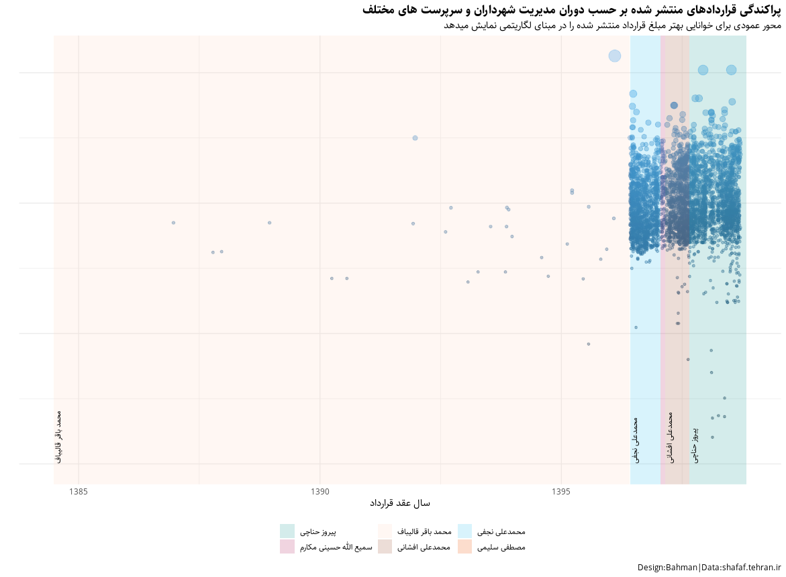
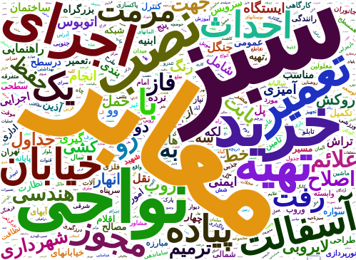
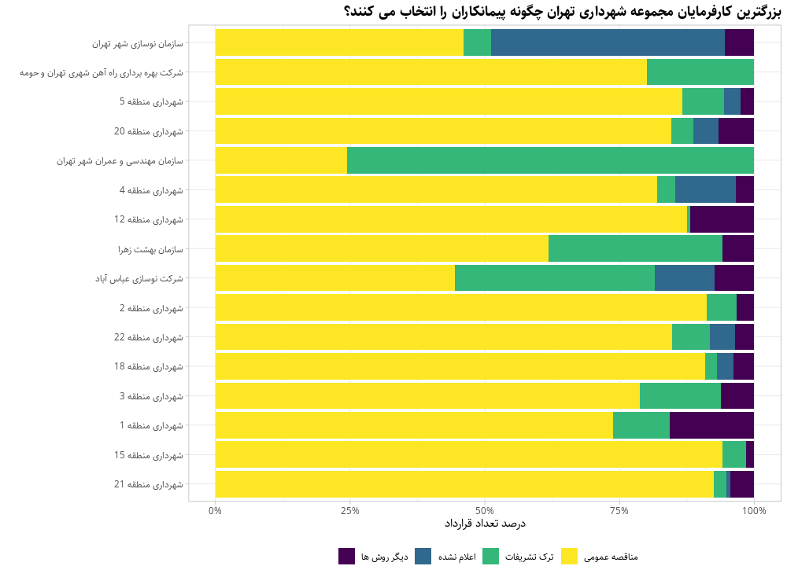
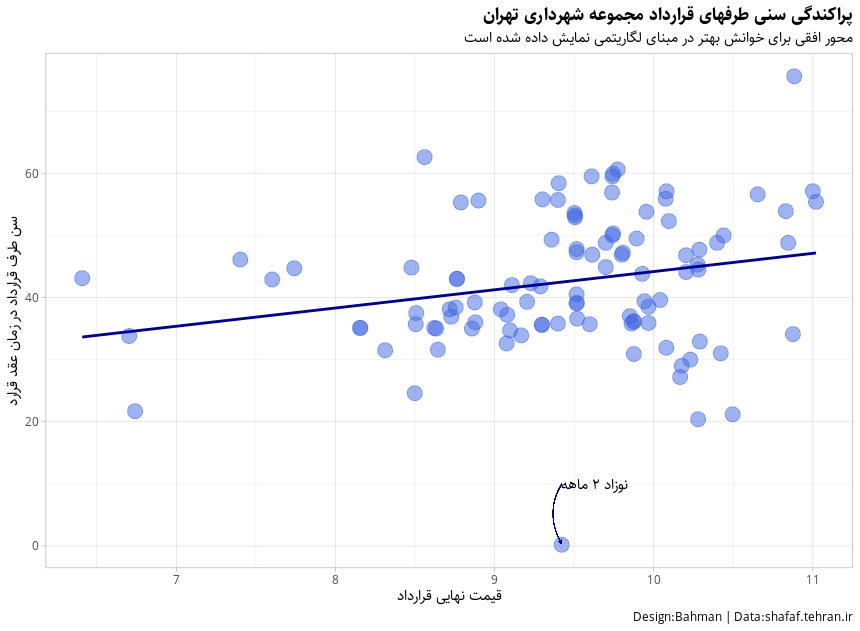
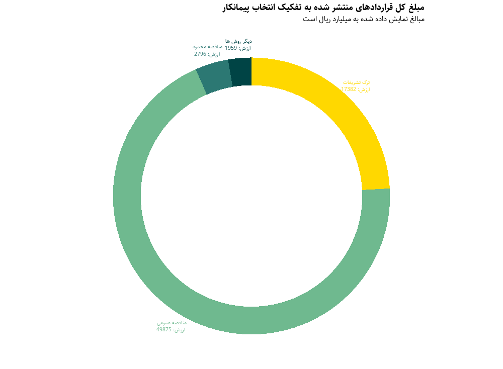

# Aanlysis of big contracts in Tehran's Municipality

## Introduction
This document provides some insights from a public dataset provided by Tehran's Municipality. The dataset is about the big contracts of Tehran's Municipality from 2010 to present. You may find the the data [here](https://shafaf.tehran.ir/Default.aspx?tabid=458).For any reason that you couldn't retrieve the streaming data, you my find the data in the data folder of this repository.  The final report is not in English language so it will not provided here. For data cleaning, I had to use some REGEX in Persian(Farsi) language.

## Some Visualizations

### Data range in Jalali calnedar

### Word Cloud for topics

### Methods used for contractor 

### Age of contractors on amount size

### Donut chart for contracts types 

